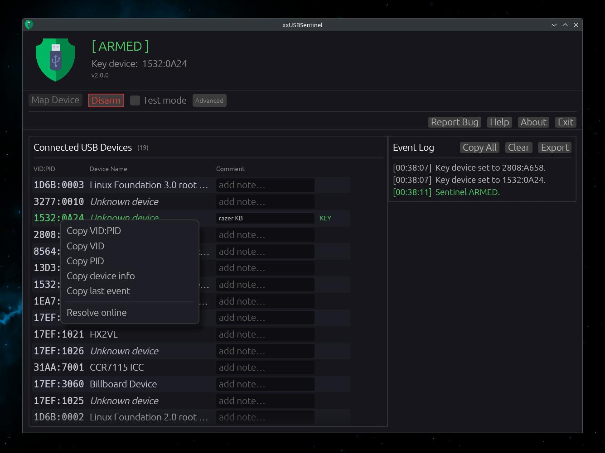
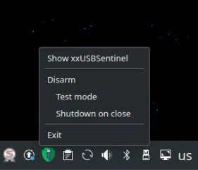

# xxUSBSentinel

<!-- CI / Release -->
[](https://github.com/thereisnotime/xxUSBSentinel/actions/workflows/ci.yml)
[](https://github.com/thereisnotime/xxUSBSentinel/actions/workflows/release.yml)
[](https://github.com/thereisnotime/xxUSBSentinel/releases/latest)
[](LICENSE)

<!-- Quality / Security -->
[](https://codecov.io/gh/thereisnotime/xxUSBSentinel)
[](https://scorecard.dev/viewer/?uri=github.com/thereisnotime/xxUSBSentinel)
[](https://deps.rs/repo/github/thereisnotime/xxUSBSentinel)

<!-- Stack -->


USB kill-switch for Linux and Windows. Map any USB device as a key. When it is removed while the sentinel is armed, the machine shuts down immediately. Designed to make recovering encrypted drive keys as hard as possible if someone physically seizes your machine.

> ⚠️ **Warning:** This tool does not encrypt your data. Use full-disk encryption (LUKS, VeraCrypt, BitLocker) alongside it.

---

## How it works

1. Plug in the USB device you want to use as your key (mouse, keyboard, flash drive, anything).
2. Click **Set Key** next to it in the device list, or use **Map Device** and physically unplug it to auto-detect.
3. Click **Arm Sentinel**.
4. If the key device is removed while armed, the machine shuts down immediately.

---

## Features

- Monitor and log all USB connect and disconnect events in real time
- Map any USB device as the kill-switch key by VID:PID
- Immediate forced shutdown on key removal
- Test mode for safe dry-runs without triggering a real shutdown
- Shutdown on close option
- Desktop notifications on trigger
- Per-device comments
- Event log with timestamps, copy and export
- System tray icon with arm/disarm and toggle controls
- Autostart on login
- Persistent config across restarts
- Permissions warning if the current user cannot shut down

---

## Screenshots




---

## Installation

### Pre-built binary

Download the latest release from the [Releases](https://github.com/thereisnotime/xxUSBSentinel/releases) page and run the binary. No installation needed.

### Build from source

**Requirements (Linux):**
```sh
sudo apt install libusb-1.0-0-dev libxdo-dev pkg-config
```

**Build:**
```sh
just release
# binary at target/release/xxusbsentinel
```

Or without just:
```sh
cargo build --release
```

**Install to `~/.local/bin`:**
```sh
just install
```

---

## Development

```
just build        # debug build
just check        # type-check only
just clippy       # lint
just fmt          # format
just test         # run tests
just ci           # fmt-check + clippy + test
just clean        # remove build artefacts
just bump-patch   # bump x.y.Z
just bump-minor   # bump x.Y.0
just bump-major   # bump X.0.0
just dist-linux   # package as .tar.gz
```

---

## Compatibility

| Platform | Status |
|----------|--------|
| Linux (X11 / Wayland) | Supported |
| Windows 10/11 | Supported |

---

## License

[PolyForm Noncommercial License 1.0.0](LICENSE) - free for personal and non-commercial use. Commercial use is prohibited.
