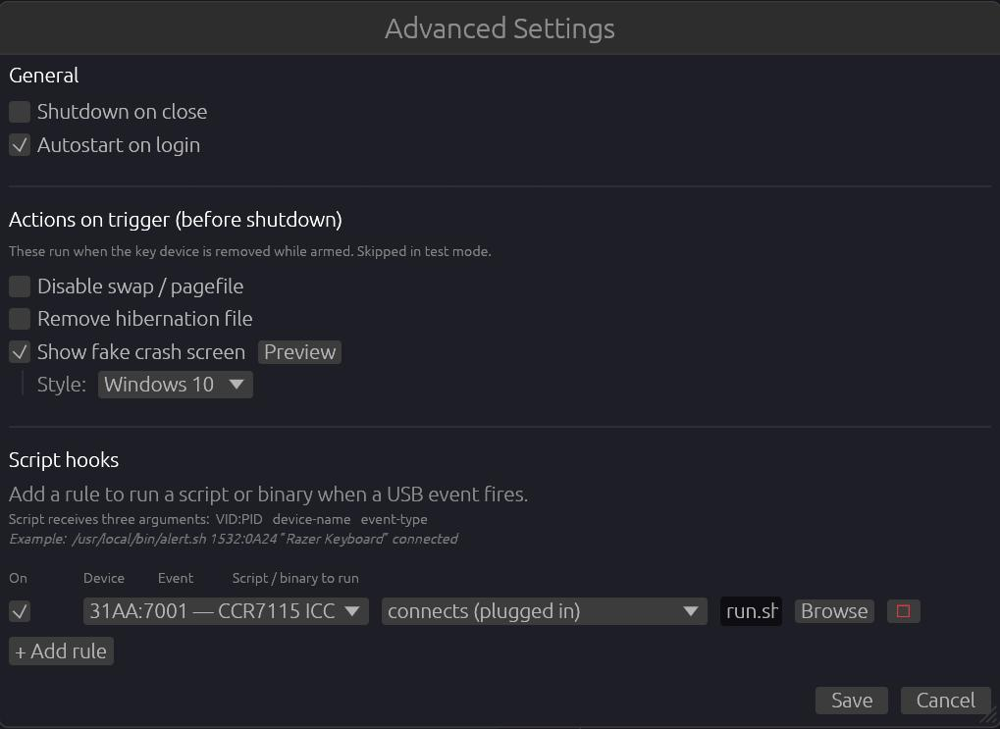

# Advanced Usage



---

## Running headless (no GUI)

There is no headless/CLI mode yet — see the [roadmap](../ROADMAP.md). Currently the app requires a display. On Linux you can run it in a minimal Openbox or i3 session, or via a virtual framebuffer:

```sh
Xvfb :99 -screen 0 1x1x8 &
DISPLAY=:99 xxusbsentinel
```

---

## Autostart on login

### Via the GUI
Enable **Autostart on login** in the Settings panel. The app creates the appropriate entry:
- **Linux** — `~/.config/autostart/xxusbsentinel.desktop`
- **Windows** — `HKCU\Software\Microsoft\Windows\CurrentVersion\Run\xxUSBSentinel`

### Manually (Linux)

```ini
# ~/.config/autostart/xxusbsentinel.desktop
[Desktop Entry]
Type=Application
Name=xxUSBSentinel
Exec=/path/to/xxusbsentinel
NoDisplay=true
```

### Manually (Windows)

```powershell
$path = (Get-Command xxusbsentinel).Source
Set-ItemProperty -Path "HKCU:\Software\Microsoft\Windows\CurrentVersion\Run" `
  -Name "xxUSBSentinel" -Value $path
```

---

## Systemd service (Linux)

To run as a systemd user service instead of autostart:

```ini
# ~/.config/systemd/user/xxusbsentinel.service
[Unit]
Description=xxUSBSentinel USB kill-switch

[Service]
ExecStart=/path/to/xxusbsentinel
Restart=on-failure
Environment=DISPLAY=:0

[Install]
WantedBy=default.target
```

```sh
systemctl --user enable --now xxusbsentinel
```

---

## Identifying a device's VID:PID

**Via the app** — plug in the device and it appears in the device list with its VID:PID in the first column.

**Via the terminal (Linux):**
```sh
lsusb
# Bus 001 Device 003: ID 046d:c52b Logitech, Inc. Unifying Receiver
```

**Via PowerShell (Windows):**
```powershell
Get-PnpDevice -Class USB | Select-Object FriendlyName, DeviceID | Format-List
```

---

## Using the Map Device feature

Instead of picking a device from the list, you can use **Map Device** to auto-detect the key:

1. Click **Map Device** — the app starts listening.
2. Physically unplug the device you want to use as the key.
3. The app records the VID:PID of the last disconnected device.

This is useful when the device list is long and you are not sure which entry corresponds to your key.

---

## Shutdown on close

When **Shutdown on close** is enabled, closing the main window while armed triggers the kill-switch (or the test popup in test mode). Normally, closing the window just minimises to the system tray.

This provides an additional kill option: if someone grabs the machine and tries to close the app, it shuts down immediately.

---

## Verifying artifacts

Every release is signed and has a SLSA provenance attestation. See [CONTRIBUTING.md](../CONTRIBUTING.md#verifying-release-artifacts) for verification commands.

---

## Config file location override

There is no environment variable override yet. The path is determined by the `dirs` crate:
- Linux: `$XDG_CONFIG_HOME/xxusbsentinel/config.toml` (falls back to `~/.config/`)
- Windows: `%APPDATA%\xxusbsentinel\config.toml`
